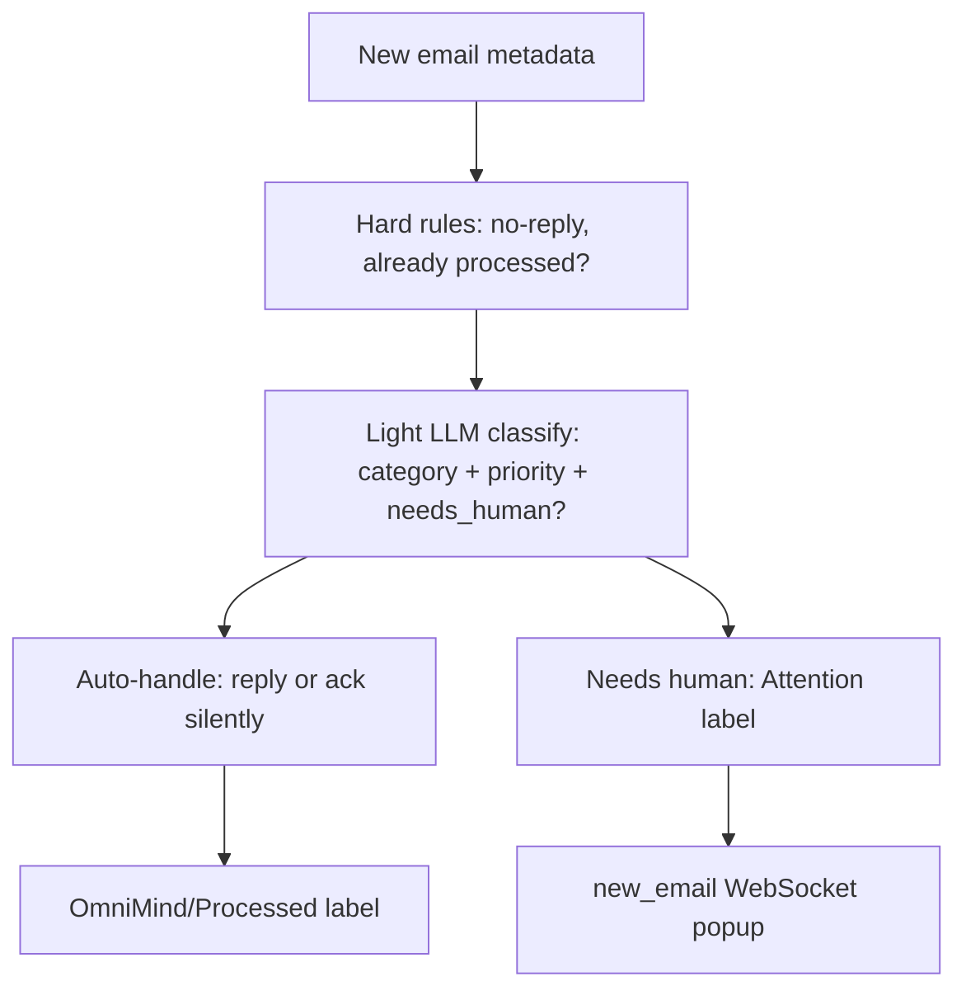
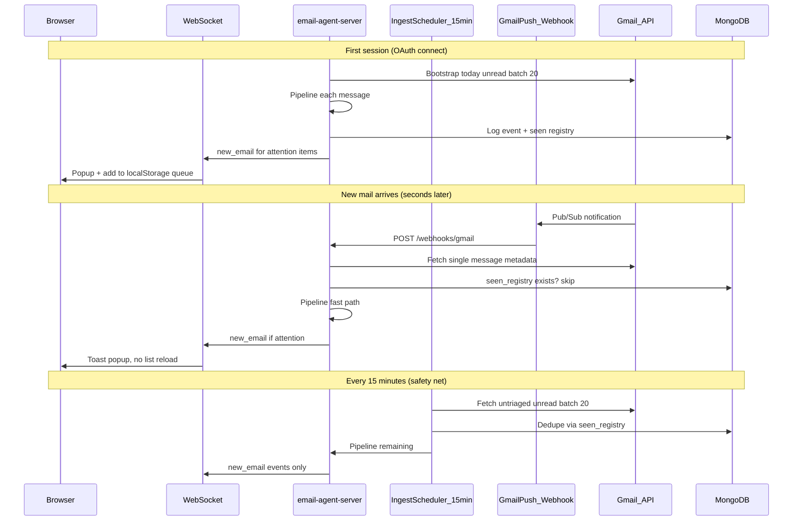

# Omnimind Email Agent — Final Implementation Plan

## What "triage" means (plain English)

**Triage** is the backend’s invisible decision step for each email — not something the user clicks.



| Step | Code today | User sees |
|------|------------|-----------|
| Hard drop (no-reply) | [`email_pipeline.py`](email-agent-server/services/email_pipeline.py) L48–58 | Nothing |
| Light classify | [`categorizer_light.py`](email-agent-server/services/llm/categorizer_light.py) `triage_email_light()` | Nothing |
| Auto-handle | pipeline L79–113 | Nothing (metrics only) |
| Needs attention | pipeline L118–140 | Card + popup |

**Product rule:** remove the words “sync” and “triage” from the UI. The agent runs automatically; users only see the **Attention Queue**.

---

## Your exact flow (15-min cron + Push + DB dedupe + popup)



### Dedupe logic (answers “check DB whether already added”)

Two layers — Gmail labels are primary, DB is fast registry:

1. **Gmail label check** (already in pipeline): skip if `OmniMind/Processed` or `OmniMind/Attention` on message.
2. **DB `email_agent_seen` collection** (new): unique index `(user_email, message_id)`. Before pipeline runs, `find_one`; if exists → skip. After any outcome, `upsert` with `outcome: auto_resolved | spam_blocked | attention_queued | user_reviewed`.

This prevents double popups if Push and 15-min cron both see the same message.

---

## Architecture decisions (locked from your answers)

| Topic | Decision |
|-------|----------|
| Batch size | 20 unread per cycle |
| First session | Immediate bootstrap: `newer_than:1d` untriaged, max 20 |
| Scheduled ingest | 15-minute daemon (replaces 60s poller as primary batch) |
| Instant new mail | Gmail Push webhook (Phase 1 core, not optional) |
| Attention queue UI | React state + `localStorage` mirror; WS deltas only |
| Open email | Lazy `POST /emails/{id}/analyze` (summary on open) |
| Close email | `POST dismiss` → Processed label → remove from queue + localStorage |
| Metrics | Persisted in MongoDB (`email_agent_events` + daily rollups) |
| Inbox DB | No email bodies in MongoDB — Gmail labels are truth |

---

## Phase 1 — Backend

### 1.1 Config changes — [`config.py`](email-agent-server/config.py)

Add/replace:

```python
ingest_interval_seconds = 900          # 15 min cron
ingest_batch_size = 20
bootstrap_query = "newer_than:1d"      # first session
gmail_push_enabled = True
gmail_pubsub_topic = ""                # from env
gmail_pubsub_subscription = ""
auto_send_enabled = True               # narrow Tier-1 only
```

Deprecate: `sync_backlog_max_results=100`, `attention_list_max_results=200`, `poller_interval_seconds=60`.

### 1.2 New files to create

| File | Purpose |
|------|---------|
| [`services/ingest_scheduler.py`](email-agent-server/services/ingest_scheduler.py) | 15-min loop: `list_users_with_gmail_tokens()` → fetch batch 20 → dedupe → pipeline |
| [`services/bootstrap_ingest.py`](email-agent-server/services/bootstrap_ingest.py) | Called once on OAuth success: today’s 20 untriaged messages |
| [`services/gmail_watch.py`](email-agent-server/services/gmail_watch.py) | `users.watch`, renew every 6 days, store `history_id` on user |
| [`services/gmail_push_handler.py`](email-agent-server/services/gmail_push_handler.py) | Parse Pub/Sub payload → `history.list` → process new message IDs |
| [`services/auto_reply_policy.py`](email-agent-server/services/auto_reply_policy.py) | Tier 1/2/3 decision + risk keyword guard (used by pipeline) |
| [`models/seen.py`](email-agent-server/models/seen.py) | `email_agent_seen` collection + `is_seen()` / `mark_seen()` |
| [`models/metrics_daily.py`](email-agent-server/models/metrics_daily.py) | `email_agent_metrics_daily` rollups via `$inc` on each event |
| [`routes/webhooks.py`](email-agent-server/routes/webhooks.py) | **Rewrite** broken stub → `POST /webhooks/gmail` |

### 1.3 Modify existing backend files

| File | Changes |
|------|---------|
| [`main.py`](email-agent-server/main.py) | Start `ingest_scheduler` instead of `incremental_poller`; register `webhooks_router`; drop `ensure_email_indexes` / `ensure_queue_indexes` |
| [`routes/auth.py`](email-agent-server/routes/auth.py) | After label provision: `gmail_watch.register(user)` + `bootstrap_ingest.run(user)` |
| [`services/email_pipeline.py`](email-agent-server/services/email_pipeline.py) | Call `seen.mark_seen()` at start/end; rename event `draft` → `attention_queued`; broadcast `metrics_updated` WS; Tier-2 ack (no send) for bill/work-high-risk keywords |
| [`services/metrics.py`](email-agent-server/services/metrics.py) | Read daily rollups only — remove `fetch_attention_labeled_emails` and Gmail thread estimates from hot path |
| [`models/event.py`](email-agent-server/models/event.py) | On `log_agent_event`, also `$inc` daily rollup; add actions `attention_queued`, `user_reviewed`, `user_replied` |
| [`lib/gmail_client.py`](email-agent-server/lib/gmail_client.py) | Add `fetch_today_untriaged_batch(creds, max=20)`; cap all list fetches to 20 |
| [`routes/emails.py`](email-agent-server/routes/emails.py) | Remove `is_db_connected()` gate on list; add `POST /{id}/dismiss` alias; WS `metrics_updated`; deprecate mount-time `/sync` from frontend |
| [`routes/cron.py`](email-agent-server/routes/cron.py) | `POST /cron/ingest` triggers one ingest cycle manually (admin/debug) |
| [`routes/agent.py`](email-agent-server/routes/agent.py) | Replace `POST /agents/email/sync` metrics storm with thin `GET` wrapper to `/emails/stats` |
| [`services/ws_manager.py`](email-agent-server/services/ws_manager.py) | No change — already broadcasts per user |

### 1.4 Auto-reply — kept, extended, always runs in pipeline (NOT removed)

Auto-reply stays a **core backend feature**. Users never see a "triage" button — the agent silently auto-handles routine mail. Only exceptions land in the Attention Queue.

**Existing code to keep and build on:**

- [`services/llm/auto_reply.py`](email-agent-server/services/llm/auto_reply.py) — `generate_auto_reply_body()` via Gemini/Groq
- [`services/llm/categorizer_light.py`](email-agent-server/services/llm/categorizer_light.py) — light classify at ingest (snippet only)
- [`services/session_stats.py`](email-agent-server/services/session_stats.py) — hourly cap (`auto_reply_hourly_cap = 60`)
- [`services/email_pipeline.py`](email-agent-server/services/email_pipeline.py) L79–113 — send + Processed label flow

**New file:** [`services/auto_reply_policy.py`](email-agent-server/services/auto_reply_policy.py)

Centralizes tier decision so pipeline stays readable:

```python
def decide_tier(email_meta, triage, user_email) -> "send" | "ack" | "attention"
```

**Three tiers (final rules):**

| Tier | When | Action | Metric event |
|------|------|--------|--------------|
| **Tier 1 — auto-send** | `auto_send_enabled=True` AND category `personal` OR simple `work` AND priority `low`/`medium` AND `needs_manual_review=False` AND sender replyable AND no risk keywords AND under hourly cap | `generate_auto_reply_body()` → `send_gmail_reply()` → Processed label | `auto_resolved` with `meta.mode: "auto_send"` |
| **Tier 2 — auto-ack** | Routine but risky: category `bill`, `critical`, priority `high`, risk keywords (`invoice`, `legal`, `offer`, `payment`, `contract`, `urgent`), or hourly cap hit | Mark Processed + mark read, **no Gmail send** | `auto_resolved` with `meta.mode: "auto_ack"` |
| **Tier 3 — attention** | `needs_manual_review=True` OR triage uncertain OR Tier 1/2 skipped | Add Attention label + WS `new_email` | `attention_queued` |

**Hard skips (never auto-reply, never attention):**

- no-reply / noreply / donotreply senders → `spam_blocked`
- spam / newsletter category → `spam_blocked`

**On every auto-reply outcome, pipeline must:**

1. `seen.mark_seen(user, message_id, outcome)`
2. `log_agent_event(...)` → append to `email_agent_events`
3. `metrics_daily.increment(...)` → update today's rollup in MongoDB
4. `session_stats.record_auto_reply()` or `record_dropped()` or `record_attention()`
5. `ws_manager.broadcast_to_user(..., {"event": "metrics_updated", "data": {...}})` — frontend stat bar updates without refetch

**Config flags in [`config.py`](email-agent-server/config.py):**

```python
auto_send_enabled: bool = True       # user toggle later via /user/preferences
auto_reply_hourly_cap: int = 60      # already exists
auto_reply_risk_keywords: list = ["invoice", "legal", "offer", "payment", "contract", "urgent", "termination"]
```

---

## Phase 2 — Frontend (no heavy reload + popup)

### 2.1 New client files

| File | Purpose |
|------|---------|
| [`client/lib/attentionStorage.ts`](client/lib/attentionStorage.ts) | `loadQueue(email)`, `saveQueue(email, cards)`, `addCard`, `removeCard`, cap 20 |
| [`client/lib/metricsStorage.ts`](client/lib/metricsStorage.ts) | Cache last `EmailStats` snapshot for instant stat bar |
| [`client/app/components/email-agents/AttentionToast.tsx`](client/app/components/email-agents/AttentionToast.tsx) | Popup on `new_email` WS: subject, sender, “View” button |

### 2.2 Modify client files

| File | Changes |
|------|---------|
| [`EmailDashboard.tsx`](client/app/components/email-agents/EmailDashboard.tsx) | Mount: read localStorage first (instant render); subscribe WS; bootstrap `GET /emails?page_size=20` only if cache empty; **remove** `triggerBackgroundSync()` + 72s poll loop; handle `metrics_updated` WS |
| [`EmailDetail.tsx`](client/app/components/email-agents/EmailDetail.tsx) | On `onClose`: call dismiss API + `removeCard` from localStorage (not just `setSelected(null)`) |
| [`automationApi.ts`](client/lib/automationApi.ts) | Add `dismissEmail()`, `loadMetricsFromStorage`, extend WS handler for `metrics_updated`; remove `waitForBufferCards` usage |
| [`page.tsx`](client/app/dashboard/agents/email/page.tsx) | Replace 15s `syncEmailAgent` polling with `GET /emails/stats` on mount + WS-driven updates |

### 2.3 Popup behavior (your “pop up without reload”)

On WS `new_email`:

1. `addEmail(card)` — prepend to React state
2. `attentionStorage.addCard(card)` — persist
3. `AttentionToast.show(card)` — 5s toast top-right
4. Optional browser `Notification` API if permission granted

No `fetchEmails(refresh: true)`. No loading spinner on the list.

---

## Phase 3 — Metrics (persisted, fast, first-class — do NOT skip)

Metrics are **not optional**. Every pipeline action writes to MongoDB so counts survive server restarts and power the dashboard honestly.

### Why two layers (session + DB)

| Layer | File | Purpose |
|-------|------|---------|
| Hot counters | [`session_stats.py`](email-agent-server/services/session_stats.py) | Real-time in-process counts between DB writes |
| Durable store | `email_agent_events` + `email_agent_metrics_daily` | Survives restart; powers 7-day agent page |

On read: `GET /emails/stats` returns `max(session, daily_rollup)` so counts never go backwards after restart.

### Collections (MongoDB — no email bodies)

```
email_agent_users         # tokens, label IDs, history_id
email_agent_sessions      # auth cookies
email_agent_seen          # dedupe registry (user_email + message_id)
email_agent_events        # append-only audit log (every action)
email_agent_metrics_daily # pre-aggregated counters per user per day
```

### Event → metric mapping (every pipeline outcome logs one event)

| Pipeline outcome | `action` field | Daily rollup field incremented |
|------------------|----------------|-------------------------------|
| Tier 1 auto-send | `auto_resolved` | `auto_resolved` (+ `auto_send_count`) |
| Tier 2 auto-ack | `auto_resolved` | `auto_resolved` (+ `auto_ack_count`) |
| no-reply / spam drop | `spam_blocked` | `spam_blocked` |
| Added to Attention | `attention_queued` | `attention_queued` |
| User closed email | `user_reviewed` | `user_reviewed` |
| User sent reply | `user_replied` | `user_replied` |

Event document shape:

```json
{
  "email": "user@domain.com",
  "action": "auto_resolved",
  "ts": 1717843200,
  "message_id": "abc123",
  "category": "personal",
  "priority": "low",
  "meta": { "mode": "auto_send" }
}
```

### Metrics API — [`GET /emails/stats`](email-agent-server/routes/emails.py)

Returns (no Gmail list fetch, no 3 sequential `count_documents`):

```json
{
  "current_active_buffer_cards": 2,
  "auto_replies_total": 12,
  "system_dropped_total": 45,
  "manual_attention_historical_total": 3,
  "auto_resolved_today": 12,
  "spam_blocked_today": 45,
  "attention_queued_today": 3,
  "user_reviewed_today": 2,
  "user_replied_today": 1,
  "automation_rate": 78.5,
  "auto_send_count_today": 8,
  "auto_ack_count_today": 4,
  "by_category": { "work": 1, "critical": 1 },
  "by_priority": { "high": 1, "medium": 1 },
  "last_updated": "2026-06-08T12:00:00Z"
}
```

`automation_rate` = `auto_resolved / (auto_resolved + spam_blocked + attention_queued)` for today.

### Agent overview page — [`page.tsx`](client/app/dashboard/agents/email/page.tsx)

- `GET /emails/stats?period=7d` — sum last 7 daily rollups for overview cards
- Remove `POST /agents/email/sync` from stats loading (was triggering triage + Gmail fetches)
- Show: Monitored (attention now), Auto-replied (7d), Filtered (7d), Needs you (7d), Automation rate

### Frontend stat bar — [`EmailStats.tsx`](client/app/components/email-agents/EmailStats.tsx)

Keep existing 6 cards, wire to persisted metrics:

| Card | Source field |
|------|-------------|
| Pending | `current_active_buffer_cards` (or local queue length) |
| Auto-replied | `auto_replies_total` (today or session) |
| Manual | `manual_attention_historical_total` / `attention_queued_today` |
| Dropped | `system_dropped_total` |
| Critical | `critical_unread` from local queue filter |
| Today | `auto_resolved_today + spam_blocked_today` |

### WS `metrics_updated` — live increment without refetch

Emitted by pipeline after **every** outcome (auto-reply, drop, attention, dismiss, send):

```json
{
  "event": "metrics_updated",
  "data": {
    "auto_replies_total": 13,
    "system_dropped_total": 45,
    "manual_attention_historical_total": 4,
    "current_active_buffer_cards": 2,
    "automation_rate": 79.1
  }
}
```

Frontend ([`EmailDashboard.tsx`](client/app/components/email-agents/EmailDashboard.tsx) + [`metricsStorage.ts`](client/lib/metricsStorage.ts)):

1. On WS `metrics_updated` → merge into React stats state + write `localStorage`
2. On mount → hydrate from `localStorage`, then one background `GET /emails/stats` to reconcile
3. Never poll every 15s

---

## Files to DELETE

| File | Reason |
|------|--------|
| [`models/email.py`](email-agent-server/models/email.py) | Legacy inbox buffer — Gmail labels replace it |
| [`models/queue.py`](email-agent-server/models/queue.py) | Legacy staging queue — unused |
| [`services/incremental_poller.py`](email-agent-server/services/incremental_poller.py) | Replaced by `ingest_scheduler.py` (15 min) + Push |
| [`lib/groq_client.py`](email-agent-server/lib/groq_client.py) | Unused duplicate of [`services/llm/client.py`](email-agent-server/services/llm/client.py) |
| [`routes/user.py`](email-agent-server/routes/user.py) | Orphan stub, not mounted; duplicates [`models/user.py`](email-agent-server/models/user.py) |
| [`services/notifications/daily_digest.py`](email-agent-server/services/notifications/daily_digest.py) | Not wired in `main.py` |
| [`services/notifications/weekly_report.py`](email-agent-server/services/notifications/weekly_report.py) | Not wired |
| [`services/notifications/critical_alert.py`](email-agent-server/services/notifications/critical_alert.py) | Not wired |

**Slim down (keep file, remove dead code):**

- [`services/sync.py`](email-agent-server/services/sync.py) — fold into `ingest_scheduler.py` or keep as shared helper only
- [`services/attention_cache.py`](email-agent-server/services/attention_cache.py) — keep **analyze cache only**; remove list cache (localStorage owns list)

**Delete folder after moving logic:**

- `email-agent-server/services/notifications/` (entire folder)

---

## Final folder structure

```
email-agent-server/
├── main.py
├── config.py
├── requirements.txt
├── db/
│   └── mongodb.py
├── lib/
│   ├── google_client.py
│   ├── gmail_client.py
│   └── gmail_labels.py
├── models/
│   ├── user.py
│   ├── session.py
│   ├── event.py
│   ├── seen.py              # NEW
│   └── metrics_daily.py     # NEW
├── routes/
│   ├── auth.py
│   ├── emails.py
│   ├── agent.py
│   ├── cron.py
│   └── webhooks.py          # REWRITTEN
└── services/
    ├── email_pipeline.py
    ├── ingest_scheduler.py  # NEW (15-min cron)
    ├── bootstrap_ingest.py  # NEW (first session 20)
    ├── gmail_watch.py       # NEW
    ├── gmail_push_handler.py# NEW
    ├── auto_reply_policy.py # NEW
    ├── metrics.py
    ├── session_stats.py
    ├── ws_manager.py
    ├── cleanup_engine.py
    ├── sync.py              # optional thin helper
    ├── attention_cache.py   # analyze-only
    └── llm/
        ├── client.py
        ├── categorizer_light.py
        ├── auto_reply.py
        └── summarizer.py

client/
├── lib/
│   ├── automationApi.ts
│   ├── attentionStorage.ts  # NEW
│   └── metricsStorage.ts    # NEW
└── app/
    ├── dashboard/agents/email/page.tsx
    └── components/email-agents/
        ├── EmailDashboard.tsx
        ├── EmailDetail.tsx
        ├── EmailCard.tsx
        ├── EmailStats.tsx
        ├── ConnectGmail.tsx
        └── AttentionToast.tsx  # NEW
```

---

## GCP setup required for Push (document in README, not code)

1. Create Pub/Sub topic + push subscription pointing to `https://<server>/webhooks/gmail`
2. Enable Gmail API push notifications
3. Set env vars: `GMAIL_PUBSUB_TOPIC`, verify subscription OIDC
4. On OAuth connect: `users.watch` with topic name; renew before 7-day expiry

---

## Implementation order

1. **Metrics + auto-reply foundation** — `metrics_daily.py`, `auto_reply_policy.py`, extend `event.py` rollups, pipeline logs + `metrics_updated` WS on every outcome
2. **Dedupe registry** — `seen.py`, wire into pipeline + ingest scheduler
3. **Ingest scheduler** — 15-min cron + bootstrap on auth; pipeline calls `auto_reply_policy.decide_tier()`
4. **Frontend localStorage + WS** — attention queue popup, metricsStorage, EmailStats live increments, dismiss-on-close
5. **Gmail Push** — `gmail_watch.py`, rewrite `webhooks.py`, register in `main.py`
6. **Cleanup** — delete legacy files, remove list cache, update `main.py` indexes

---

## Success criteria

- Dashboard opens in under 300ms (localStorage hydrate)
- New attention email pops up within seconds (Push) without list reload
- 15-min cron catches anything Push missed (no duplicates thanks to `email_agent_seen`)
- Closing an email removes it from queue and marks Processed in Gmail
- **Auto-reply runs silently on routine mail** — Tier 1 sends, Tier 2 acks without send, Tier 3 surfaces to queue
- **Every auto-reply/drop/attention event increments persisted metrics** — survives server restart
- Stat bar updates live via WS `metrics_updated` — no 15s polling, no `POST /agents/email/sync`
- Agent overview page shows honest 7-day metrics from `email_agent_metrics_daily`
- User never sees “triaging” or “syncing” in normal operation
