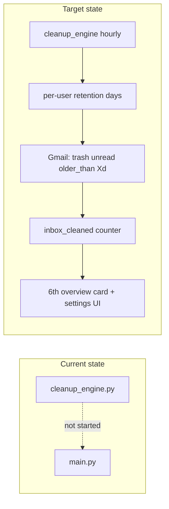

# Autonomous Old-Unread Cleanup + 6th Metric

## What you already have (80% built)

The backend skeleton exists but is **not running**:

| Piece | File | Status |
|-------|------|--------|
| Hourly daemon loop | [`email-agent-server/services/cleanup_engine.py`](email-agent-server/services/cleanup_engine.py) | Written, **not started** in [`main.py`](email-agent-server/main.py) |
| Gmail fetch + trash | [`fetch_old_unread_messages`](email-agent-server/lib/gmail_client.py), `batch_move_to_trash` | Hardcoded `older_than:2m` |
| Config knobs | [`config.py`](email-agent-server/config.py) `cleanup_batch_size`, `cleanup_interval_seconds` | Global only |



## Recommendation (based on your answers)

- **Retention:** Per-user setting from day one — presets (30 / 60 / 90 / 180 days) **plus** custom numeric input (validate e.g. 7–365 days). Default **60 days** (2 months).
- **Deletion semantics:** Move to **Gmail Trash** (`batchTrash`) — simple, reversible, no LLM, no categorization.
- **Safety scope (non-negotiable):**
  - Only `is:unread`
  - Exclude `OmniMind/Attention` and `OmniMind/Processed` labels (never touch attention queue)
  - Batch cap per user per cycle (`cleanup_batch_size`, default 50)
- **6th metric placement:** Add to the **agent overview page** ([`page.tsx`](client/app/dashboard/agents/email/page.tsx)) which currently has **5 cards** — not the in-dashboard `EmailStats.tsx` bar (that one has 6 different live-queue metrics).

## Backend changes

### 1. Per-user cleanup preferences (MongoDB)

Extend [`models/user.py`](email-agent-server/models/user.py) user document:

```python
cleanup_settings: {
  "enabled": true,
  "older_than_days": 60   # custom or preset value
}
```

Add helpers: `get_cleanup_settings(user)`, `update_cleanup_settings(email, enabled, older_than_days)`.

### 2. Settings API

New routes (thin, in [`routes/agent.py`](email-agent-server/routes/agent.py) or new `routes/settings.py`):

- `GET /agents/email/cleanup-settings?user_email=...` — return enabled + days
- `PATCH /agents/email/cleanup-settings` — body: `{ user_email, enabled?, older_than_days? }` with validation (7–365, integer)

### 3. Fix + parameterize Gmail query

In [`lib/gmail_client.py`](email-agent-server/lib/gmail_client.py):

- Change `fetch_old_unread_messages(creds, batch_size, older_than_days)` to build:
  ```
  is:unread older_than:{days}d -label:OmniMind/Attention -label:OmniMind/Processed
  ```
- **Bug fix:** current query uses `-label:OmniMind-Attention` (wrong); align with [`UNTRIAGED_FILTER`](email-agent-server/lib/gmail_client.py) slash format.

### 4. Wire cleanup engine + metrics

**Start daemon** in [`main.py`](email-agent-server/main.py) lifespan (alongside ingest scheduler):

```python
cleanup_task = asyncio.create_task(start_cleanup_engine())
```

Enhance [`cleanup_engine.py`](email-agent-server/services/cleanup_engine.py) per user:

1. Read `cleanup_settings` — skip if `enabled: false`
2. Fetch old unread IDs with user's `older_than_days`
3. `batch_move_to_trash`
4. For each batch, call `log_agent_event(user_email, "inbox_cleaned", message_id=...)` **or** one event with `meta.count` (prefer per-message for audit, batch increment for metrics)
5. `session_stats` optional counter + `_broadcast_metrics` WS (reuse pattern from [`routes/emails.py`](email-agent-server/routes/emails.py))

**New metric field** in [`models/metrics_daily.py`](email-agent-server/models/metrics_daily.py):

- Add `inbox_cleaned` to `COUNTER_FIELDS`

**New event mapping** in [`models/event.py`](email-agent-server/models/event.py):

```python
"inbox_cleaned": { "inbox_cleaned": 1 }
```

Expose in stats APIs:

- [`routes/emails.py`](email-agent-server/routes/emails.py) `GET /emails/stats` → `inbox_cleaned_today`, rollup `inbox_cleaned`
- [`routes/agent.py`](email-agent-server/routes/agent.py) `GET /agents/email` → `inbox_cleaned_total` (7d rollup)

## Frontend changes

### 5. Types + API client

In [`client/lib/automationApi.ts`](client/lib/automationApi.ts):

- Extend `EmailStats` with `inboxCleanedTotal?`, `inboxCleanedToday?`
- Add `fetchCleanupSettings`, `updateCleanupSettings`

### 6. 6th overview card

In [`client/app/dashboard/agents/email/page.tsx`](client/app/dashboard/agents/email/page.tsx):

- Add 6th `STAT_CARDS` entry, e.g. **"inbox cleaned"** with 7-day `inbox_cleaned_total` subtext "old unread auto-trashed"
- Update grid from `lg:grid-cols-5` → `lg:grid-cols-6` (or `grid-cols-3` on md for balance)
- Map field in `applyStats` from overview response

### 7. Retention settings UI (compact, not full-page)

Add a small **Cleanup** panel on the email agent page (above `EmailDashboard`), only when connected:

- Toggle: **Auto-clean old unread mail**
- Preset chips: 30d / 60d / 90d / 180d
- Custom input: number of days + Save
- Helper text: "Unread mail older than X days is moved to Gmail Trash. Attention queue is never touched."

Persist via `PATCH /agents/email/cleanup-settings`; load on mount.

### 8. Optional: live stat in dashboard bar

Low priority — can add `Cleaned` to [`EmailStats.tsx`](client/app/components/email-agents/EmailStats.tsx) showing `inboxCleanedToday` via WS `metrics_updated` later. **Not required for Phase 1** if overview 6th card is the goal.

## What NOT to do

- Do not run LLM triage in cleanup — age + unread only
- Do not permanently delete (`messages.delete`) — trash is safer
- Do not trash Attention-labeled mail
- Do not merge into "Dropped" — separate `inbox_cleaned` metric (user-visible automation distinct from spam/system drops)

## Testing checklist

1. Set retention to 7 days (custom) on test account → verify query uses `older_than:7d`
2. Confirm Attention-queue emails are never in trash batch
3. After engine runs, `inbox_cleaned` increments in MongoDB + 6th card updates
4. Disable toggle → engine skips user
5. Invalid custom input (e.g. 2 days, 500 days) → API 400

## File touch list (minimal)

| File | Change |
|------|--------|
| `email-agent-server/main.py` | Start cleanup task |
| `email-agent-server/services/cleanup_engine.py` | Per-user settings, metrics, WS |
| `email-agent-server/lib/gmail_client.py` | Param days, fix label query |
| `email-agent-server/models/metrics_daily.py` | `inbox_cleaned` counter |
| `email-agent-server/models/event.py` | Event map |
| `email-agent-server/models/user.py` | Settings helpers |
| `email-agent-server/routes/agent.py` | Settings endpoints + rollup field |
| `email-agent-server/routes/emails.py` | Stats field + WS payload |
| `client/lib/automationApi.ts` | Types + API |
| `client/app/dashboard/agents/email/page.tsx` | 6th card + settings UI |
